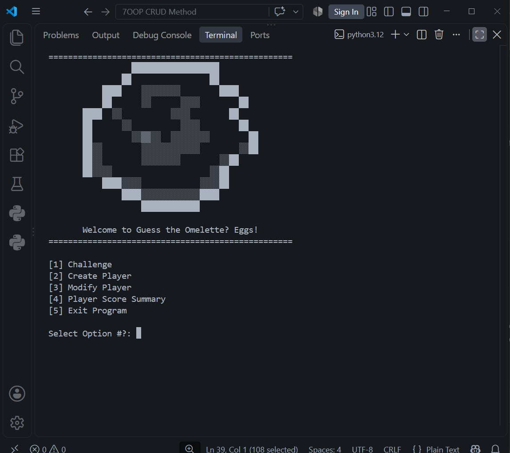

# Guess the Omelette? Eggs! Game

<p align="center">
  
</p>

A Python Command Line Interface Game that lets you create multiple players with their favorite Egg Dishes choices. Players can guess what eggs other players like when in a challenge. The game has a score mechanics for players, their egg dishes, and their omelette egg too.

## Installation

Install Python to your designated package manager.
- e.g. `sudo apt install python` (Debian)

Clone this repository to your local device:

```bash
cd ~
git clone https://github.com/EditorOne-XI/guess-omelette-egg.git
```

You can run the game with Python:

```bash
python ~/guess-omelette-egg/omeletteegg.py
```

## License

Please refer to the [License](LICENSE) section.

---

*You do not actually win?*

Project Started on 2026, September 2nd.
I might plan the TUI version of this game soon. 

Thank You! <br> - EditorOne XI
